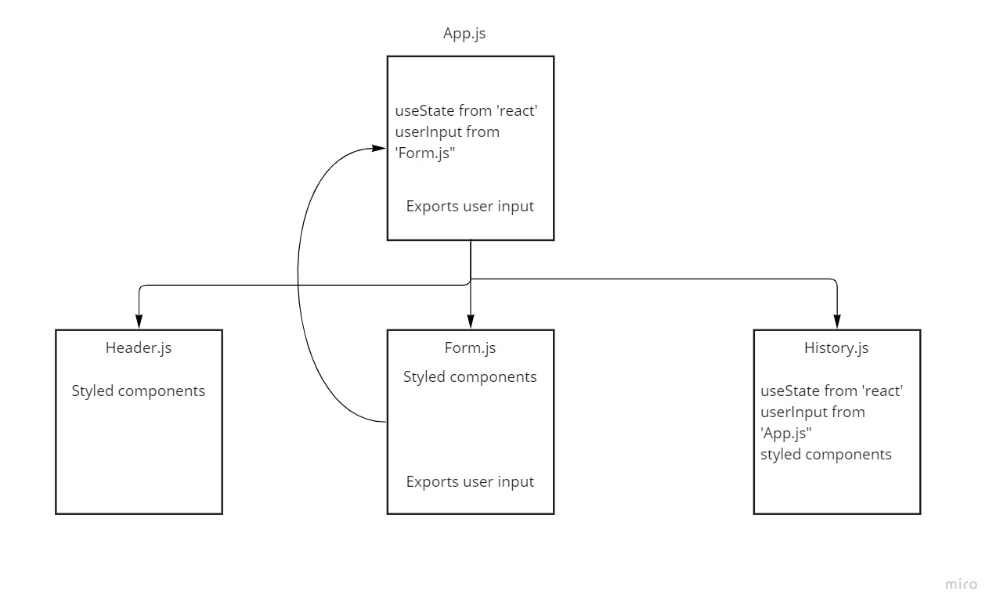

# RESTy-API

My application will be an API testing tool that can be run in any browser, allowing a user to easily interact with APIs in a familiar interface.

## Submission Links

- [PR Link](https://github.com/karamalqinneh/RESTy-API/pull/3)
- [Deployed Version](https://6266f0da0af0510009aa6e4c--famous-griffin-58aa36.netlify.app/)

## UML Diagram

- 
